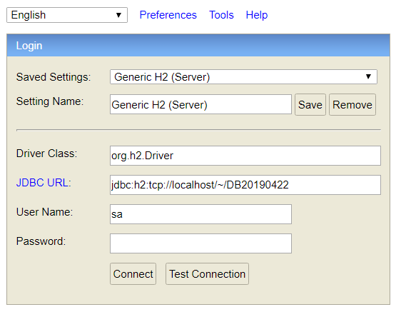
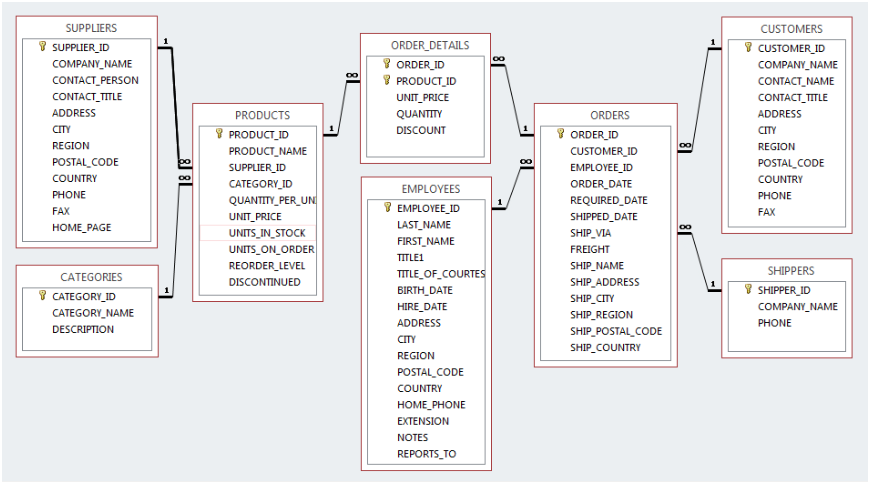

# Hibernate with Spring

### Download h2 database from here:

<a href="http://www.h2database.com/h2-2018-03-18.zip">h2 database</a>

### How to use h2 database?

* Unzip the downloaded file `h2-2018-03-18.zip`
* Go to *h2-2018-03-18/bin* folder
* Windows - double click the *h2.bat* file
* Linux - run the *h2.sh* in a terminal

This will start a RDBMS server and also opens a client application in a browser.


If the server doesn't start due to port issues, create/update the *.h2.server.properties* file in the home directory with the following (change the webPort to some other unused port): 

```
0=Generic H2 (Server)|org.h2.Driver|jdbc\:h2\:tcp\://localhost/~/DB20190422|sa
webAllowOthers=false
webPort=8082
webSSL=false
```



* Select **Generic H2 (Server)** from the *Saved settings* dropdown
* Driver class - **org.h2.Driver** 
* URL - jdbc:h2:tcp://localhost/~/DB20190422
* Username - sa (you may change if you want)
* Password - (empty by default, you may change if you want)

Click the **Connect** button.


### Download the database script from here:

<a href="https://github.com/shubhambalyan/hibernate-with-spring/blob/master/resources/database/dbscript.zip">DB Script (zip file)</a>


### Command to import tables and data from the script file in h2 database:

```sql
runscript from 'ABSOULTE_PATH_TO_THE_DBSCRIPT.SQL_FILE'
```

### For MySQL download the script from here:

<a href="https://github.com/shubhambalyan/hibernate-with-spring/blob/master/resources/database/MySQL_Northwind.sql" target="_blank">MySQL_Northwind.sql (SQL file)</a>


The tables and relationships among the same is explained here:




### Hibernate dependency (Maven)

```xml
<dependency>
    <groupId>org.hibernate</groupId>
    <artifactId>hibernate-core</artifactId>
    <version>4.3.11.Final</version>
</dependency>
```

### Sample hibernate.cfg.xml

```xml
<?xml version='1.0' encoding='utf-8'?>

<!DOCTYPE hibernate-configuration PUBLIC
"-//Hibernate/Hibernate Configuration DTD//EN"
"http://hibernate.sourceforge.net/hibernate-configuration-3.0.dtd">

<hibernate-configuration>
	<session-factory>
		<property name="hibernate.connection.driver_class">org.h2.Driver</property>
		<property name="hibernate.connection.url">jdbc:h2:tcp://localhost/~/2019_01_HIBERNATE_SPRING_HPE</property>
		<property name="hibernate.connection.username">sa</property>
		<property name="hibernate.connection.password"></property>

		<property name="show_sql">true</property>
		<property name="format_sql">true</property>
		<property name="dialect">org.hibernate.dialect.H2Dialect</property>
	</session-factory>
</hibernate-configuration>

```